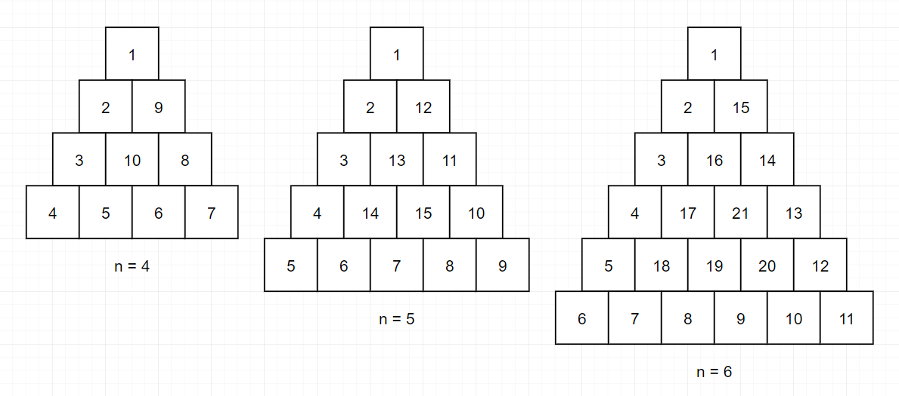
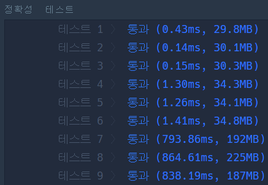
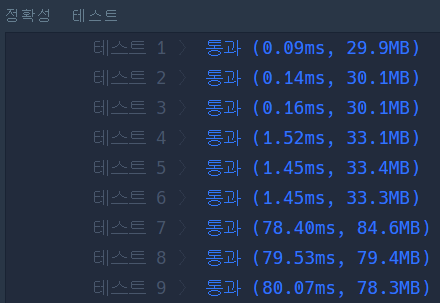

## 문제

> 출처: 프로그래머스 코딩테스트 연습, 삼각 달팽이
> <br>https://programmers.co.kr/learn/courses/30/lessons/68645

### 문제 설명

정수 n이 매개변수로 주어집니다. 다음 그림과 같이 밑변의 길이와 높이가 n인 삼각형에서 맨 위 꼭짓점부터 반시계 방향으로 달팽이 채우기를 진행한 후, 첫 행부터 마지막 행까지 모두 순서대로 합친 새로운 배열을 return 하도록 solution 함수를 완성해주세요.



### 제한사항

- n은 1 이상 1,000 이하입니다.

### 입출력 예

| n   | result                                                  |
| --- | ------------------------------------------------------- |
| 4   | [1,2,9,3,10,8,4,5,6,7]                                  |
| 5   | [1,2,12,3,13,11,4,14,15,10,5,6,7,8,9]                   |
| 6   | [1,2,15,3,16,14,4,17,21,13,5,18,19,20,12,6,7,8,9,10,11] |

#### 입출력 예 설명

입출력 예 #1

문제 예시와 같습니다.
입출력 예 #2

문제 예시와 같습니다.
입출력 예 #3

문제 예시와 같습니다.

## 코드

### 처음 작성한 코드

```
function solution(n) {
    const snail = Array(n);
    const dx = [0, 1, -1];
    const dy = [1, 0, -1];
    let num = 1;
    let x = 0;
    let y = 0;
    let dir = 0;

    for(let i = 0;i < n;i++) {
        snail[i] = Array(i + 1).fill(0);
    }

    for(let i = n;i > 0;i--) {
        for(let j = 0;j < i;j++) {
            snail[y][x] = num;
            num += 1;
            if(j + 1 === i) dir = (dir + 1) % 3;
            x += dx[dir];
            y += dy[dir];
        }
    }

    return snail.reduce((arr,cur) => arr.concat(cur));
}
```

- 삼각형 피라미드 모양 2차원 배열을 만듦
- 길이가 n ~ 1인 변을 반시계방향으로 채워나감
- 처음에 재귀함수로 작성했으나 n이 커지면 callstack이 초과되는 문제가 발생하였음
  - 반복문으로 변경

### 개선한 코드

```
function solution(n) {
    const snail = Array(n).fill().map((row, i) => Array(i + 1).fill(0));
    const [dx, dy] = [[0, 1, -1], [1, 0, -1]];
    let [num, x, y, dir] = [1, 0, 0, 0];

    for(let i = n;i > 0;i--) {
        for(let j = 0;j < i;j++) {
            snail[y][x] = num++;
            if(j + 1 === i) dir = (dir + 1) % 3;
            x += dx[dir];
            y += dy[dir];
        }
    }

    return snail.flat();
}
```

- 구조분해할당을 이용해 변수를 선언
- reduce 메서드 대신 flat 메서드를 사용
  - 더 간결하고 좋은 성능.
  - n이 클수록 reduce에 비해 매우 빠른 처리속도

#### reduce를 사용했을 때



#### flat을 사용했을 때


