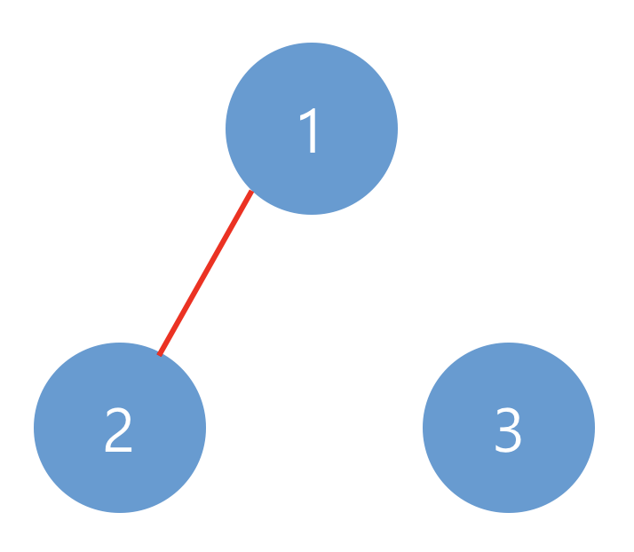
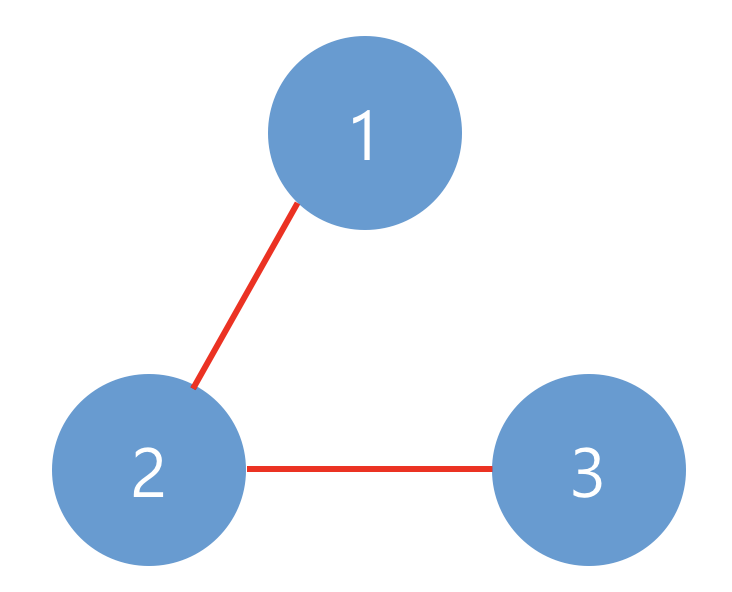

## 문제

---

> 출처: 프로그래머스 코딩테스트 연습, 네트워크<br>https://programmers.co.kr/learn/courses/30/lessons/43162

### 문제 설명

네트워크란 컴퓨터 상호 간에 정보를 교환할 수 있도록 연결된 형태를 의미합니다. 예를 들어, 컴퓨터 A와 컴퓨터 B가 직접적으로 연결되어있고, 컴퓨터 B와 컴퓨터 C가 직접적으로 연결되어 있을 때 컴퓨터 A와 컴퓨터 C도 간접적으로 연결되어 정보를 교환할 수 있습니다. 따라서 컴퓨터 A, B, C는 모두 같은 네트워크 상에 있다고 할 수 있습니다.

컴퓨터의 개수 n, 연결에 대한 정보가 담긴 2차원 배열 computers가 매개변수로 주어질 때, 네트워크의 개수를 return 하도록 solution 함수를 작성하시오.

### 제한사항

- 컴퓨터의 개수 n은 1 이상 200 이하인 자연수입니다.
- 각 컴퓨터는 0부터 `n-1` 인 정수로 표현합니다.
- i번 컴퓨터와 j번 컴퓨터가 연결되어 있으면 computers[i][j]를 1로 표현합니다.
  computer[i][i]는 항상 1입니다.

### 입출력 예

| n   | computers                         | return |
| --- | --------------------------------- | ------ |
| 3   | [[1, 1, 0], [1, 1, 0], [0, 0, 1]] | 2      |
| 3   | [[1, 1, 0], [1, 1, 1], [0, 1, 1]] | 1      |

#### 입출력 예 설명

예제 #1
아래와 같이 2개의 네트워크가 있습니다.


예제 #2
아래와 같이 1개의 네트워크가 있습니다.


## 코드

### 처음 통과한 코드

```
function solution(n, computers) {
    let answer = [];

    for(let i = 0;i < n;i++){
        findNetwork(i, []);
    }

    return [...new Set(answer.map(el=>el.join('')))].length;

    function findNetwork(computer, network) {
        let count = 0;

        computers[computer].forEach((edge, index) => {
            if(edge === 1 && !network.includes(index)) {
                network.push(index);
                findNetwork(index, network);
            } else {
                count++;
            }
        });

        if(count === n){
            answer.push(network.sort((a, b) => a - b));
        }
    }
}
```

- leaf node에 다다를 때까지 네트워크에 노드를 추가하면서 재귀호출함.
- 가능한 모든 네트워크를 찾고, 중복(순서만 다른 것)을 제거함.
- 중복을 제거하기위해 정렬하고 비교하는 과정이 필요해 비효율 적이고, 코드도 복잡해짐.

### 개선한 코드

```
function solution(n, computers) {
    let answer = 0;
    const visited = new Array(n).fill(false);

    for(let i = 0;i < n;i++){
        answer += findNetwork(i);
    }

    return answer;

    function findNetwork(comN) {
        if(visited[comN] === true) return 0;
        else visited[comN] = true;

        for(let i = 0;i < n;i++) {
            if(computers[comN][i] === 1){
                findNetwork(i);
            }
        }

        return 1;
    }
}
```

- visited 배열을 통해 중복되는 경우는 바로 중단하고 세지 않음으로써 더 간결하고 효율적으로 탐색가능
  - visited 배열에서 해당 노드가 true라면 이미 해당 노드가 포함된 네트워크를 셋다는 뜻이므로 탐색종료.

## 풀이

- DFS를 이용해 쉽게 풀 수 있음.
- 노드 하나를 선택해 DFS로 탐색.
  - 방문을 확인하며 탐색하여 탐색이 종료되면 네트워크 개수를 더한다.
- 방문하지 않은 노드를 선택해 위 과정을 반복.
